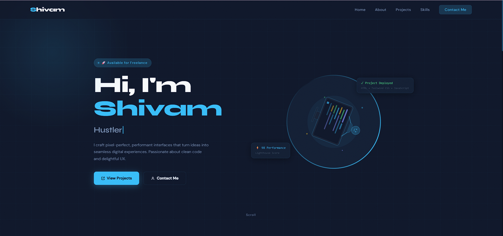

# 🚀 Portfolio Website

Welcome to my personal portfolio website!

This portfolio showcases my frontend development journey, skills, and projects. Built using HTML, CSS, and JavaScript, it features a modern user interface, responsive design, and a smooth experience across all devices.

## 📸 Preview

## 🛠️ Tech Stack

* HTML5
* CSS3
* JavaScript

## ✨ Features

* Responsive Design
* Modern UI/UX
* Project Showcase
* Skills Section
* Contact Information
* Mobile-Friendly Layout

## 🌐 Live Demo

🔗 https://myportfolio-shivamm.netlify.app/

## 📂 Repository

🔗 https://github.com/shivamsahil030/Portfolio

## 👨‍💻 Author

**Shivam Sahil**

Aspiring Full-Stack Web Developer passionate about building responsive and user-friendly web applications.

* GitHub: https://github.com/shivamsahil030
* LinkedIn: Add your LinkedIn profile link here

## 📬 Feedback

If you have any suggestions or feedback, feel free to connect with me.
